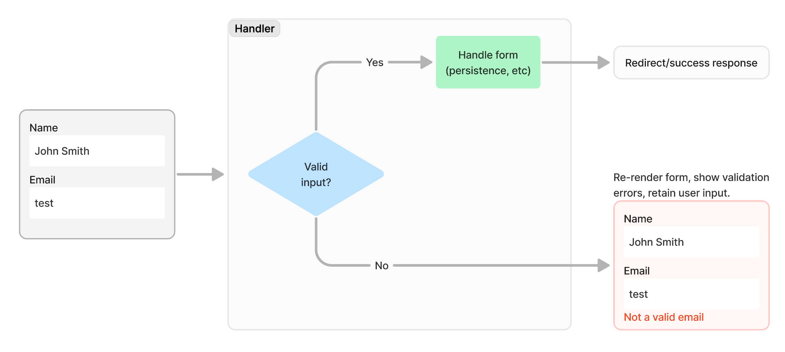

# Form validation

[Example application](https://github.com/resoluteworks/invirt/tree/main/examples/form-validation)

Invirt takes a simple approach to form validation, and is designed against the general principles
of how an HTML form should work, and common UX practices in application development.

#### Explicit, server-side validation
Validation is an explicit step performed by the handler, no "magic" and no annotations. The handler code makes an explicit
decision about the outcome of the form submission based on the validation result: success or re-render the form
to allow the user to correct the input.

This makes it easy to contain the validation on the server side, at least in most cases. It also makes integrating
responsive app concerns (like HotWire) a lateral concern, and something that can be wired _on top_ of this design.

#### Retaining input is (often) important
It's fairly common for an application to need to retain the incorrect input after a validation failure, in order
provide user with context on the elements that were filled incorrectly. It's also essential not to reset (clear)
the form on a validation error, in order to avoid the user having to re-key all the inputs.

In a setup where validation is performed on the server side, we require an additional step to the form submission
process, to return the content previously submitted to the user. Invirt tries to make this process as frictionless
as possible, but also gives the developer plenty of latitude on how to handle it.

There are exceptions to this reasoning where, for certain inputs, the application shouldn't return the incorrectly
entered value (sensitive data, etc.), but as well see, this approach doesn't prevent handling these edge-cases graciously.

In other words, at a high level, this is what Invirt is going for.

